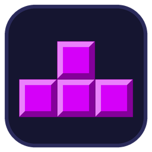

# Tetris Deluxe

Tetris en Python (tkinter + pygame) : mode solo, multijoueur local en écran
partagé avec lignes garbage, T-Spin, hold, pièce fantôme, combos, classement,
touches configurables et musique chiptune générée par le code.



## Jouer

**Windows (sans Python)** : télécharger le ZIP dans *Releases*, décompresser,
lancer `TetrisDeluxe.exe`.

**Depuis les sources** (Python ≥ 3.10) :

```bash
make install
make run          # ou : python main.py
```

## Développement

`make help` liste toutes les commandes. Les principales :

| Commande        | Rôle                                                    |
|-----------------|---------------------------------------------------------|
| `make check`    | analyse statique (ruff) + test automatique              |
| `make bench`    | temps par frame et temps de démarrage                   |
| `make profile`  | profil cProfile d'une vraie partie (`make profile-view`)|
| `make memory`   | pic mémoire et détection de fuites (tracemalloc)        |
| `make exe`      | construit `dist/TetrisDeluxe/TetrisDeluxe.exe`          |
| `make dist-zip` | ZIP prêt à publier                                      |

Sous Windows, `make` s'installe avec `winget install ezwinports.make`.

## Architecture

| Module                | Rôle                                                     |
|-----------------------|----------------------------------------------------------|
| `main.py`             | point d'entrée, menu animé, navigation                   |
| `name_panel.py`       | panneau de saisie des noms (solo / multi)                |
| `ui_sounds.py`        | sons des boutons et musique des menus                    |
| `game_solo.py`        | mode solo (animations, T-Spin, hold)                     |
| `game_multi.py`       | mode 2 joueurs, envoi de garbage                         |
| `board.py`, `pieces.py`, `score.py` | logique de jeu (sans interface)            |
| `renderer.py`         | rendu différentiel : seules les cellules modifiées sont redessinées |
| `audio.py`            | synthèse des sons et des 2 musiques (jeu, menu), cache dans `assets/audio/` |
| `settings.py`, `settings_screen.py` | paramètres persistants                     |
| `paths.py`, `version.py` | chemins (dev / .exe) et identité de l'application     |
| `tools/`              | benchmark, test, profilage, icône                        |
| `packaging/`          | recette PyInstaller                                      |

Les sauvegardes sont écrites dans le dossier du projet en développement et
dans `%APPDATA%\Tetris` pour le `.exe`.
